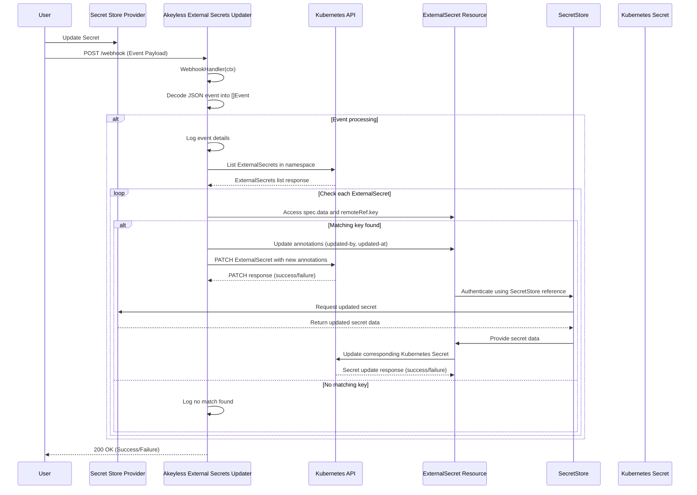

# Akeyless External Secrets Updater

This application enables a push-based model for updating ExternalSecrets in a Kubernetes cluster. It listens for webhooks triggered by secret updates in the Secret Store Provider (which can be Akeyless or any other supported ESO Secret Store Provider) and propagates these changes to the corresponding ExternalSecret resources, initiating the secret update process.

In short, this application makes it so that you can update a secret in the Secret Store Provider and have it automatically updated in the corresponding ExternalSecret resource in Kubernetes almost immediately without the need to set a frequent `refreshInterval` on the ExternalSecret resource to be sure to pick up the most recent.

## Features

- Webhook listener for SecretStore secret update events
- Automatic ExternalSecret annotation updates to trigger secret refresh
- Support for multiple ExternalSecrets in a Kubernetes namespace
- Basic authentication for webhook endpoint security
- Configurable through environment variables
- Kubernetes in-cluster configuration with fallback to local kubeconfig

## Prerequisites

- A Kubernetes cluster
- External Secrets Operator installed
- External Secrets object manifests configured with a non-zero `refreshInterval` (recommended: 24h)
- Ability to update a secret in the Secret Store Provider then trigger the this application's webhook

## Application Sequence

The following sequence diagram illustrates the application's workflow:

