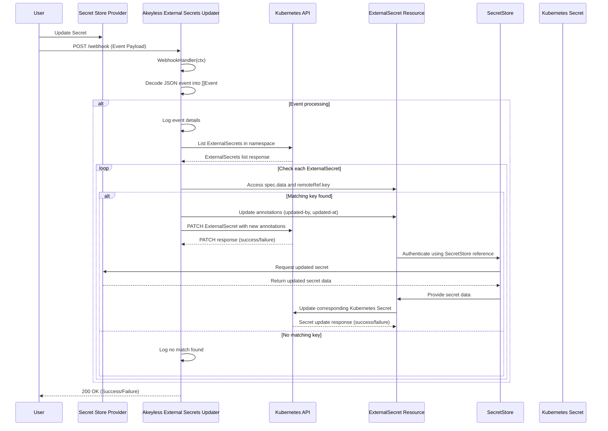

# Akeyless External Secrets Updater

This application enables a push-based model for updating ExternalSecrets in a Kubernetes cluster. It listens for webhooks triggered by secret updates in the Secret Store Provider (which can be Akeyless or any other supported ESO Secret Store Provider) and propagates these changes to the corresponding ExternalSecret resources, initiating the secret update process.

In short, this application makes it so that you can update a secret in the Secret Store Provider and have it automatically updated in the corresponding ExternalSecret resource in Kubernetes almost immediately without the need to set a frequent `refreshInterval` on the ExternalSecret resource to be sure to pick up the most recent.


## Features

- Webhook listener for SecretStore secret update events
- Automatic ExternalSecret annotation updates to trigger secret refresh
- Support for multiple ExternalSecrets in a Kubernetes namespace
- Basic authentication for webhook endpoint security
- Configurable through environment variables
- Kubernetes in-cluster configuration with fallback to local kubeconfig


## Prerequisites

- A Kubernetes cluster
- External Secrets Operator installed
- External Secrets object manifests configured with a non-zero `refreshInterval` (recommended: 24h)
- Ability to update a secret in the Secret Store Provider then trigger the this application's webhook
- Akeyless Users: Use the Event Center to forward events to this application's webhook endpoint (event center is free for Akeyless users)


## Environment Variables

The application can be configured using the following environment variables:

| Variable | Description | Default | Required |
|----------|-------------|---------|----------|
| `BASIC_AUTH_USER` | Username for basic authentication on the webhook endpoint | - | Yes |
| `BASIC_AUTH_PASSWORD` | Password for basic authentication on the webhook endpoint | - | Yes |
| `ENABLE_CACHE_BUSTER` | Enable the cache buster feature to perform a second update on ExternalSecrets | `false` | No |
| `CACHE_BUSTER_WAIT_INTERVAL` | Wait interval between the first and second update when cache buster is enabled | `2s` | No |

### Details:

- `BASIC_AUTH_USER` and `BASIC_AUTH_PASSWORD`: These credentials are used to secure the webhook endpoint. They must be set for the application to start.

- `ENABLE_CACHE_BUSTER`: When set to `"true"`, the application will perform a second update on the ExternalSecret after a short delay. This can help ensure that the changes are propagated in systems with aggressive caching.

- `CACHE_BUSTER_WAIT_INTERVAL`: Specifies the duration to wait between the first and second update when the cache buster is enabled. The value should be a valid Go duration string (e.g., "2s" for 2 seconds, "100ms" for 100 milliseconds). If not set or invalid, it defaults to 2 seconds.


### Environment Variables as Kubernetes Secrets

The environment variables are created as a Kubernetes Secret using Kustomize. In the `kustomization.yaml` file, you'll find:

```yaml
secretGenerator:
- envs:
  - configs/.env
  name: externalsecret-updater-user-secret
```

This generates a Secret named `externalsecret-updater-user-secret` using the environment variables defined in the `configs/.env` file. Make sure to create this file with the required environment variables before deploying the application.


## Deployment

The application can be deployed using the provided Taskfile. Here are the main commands and their descriptions:

### Required CLIs

Before using the Taskfile commands, ensure you have the following CLIs installed:

- `task`: Task runner (https://taskfile.dev/)
- `docker`: Container runtime (https://www.docker.com/)
- `kubectl`: Kubernetes command-line tool (https://kubernetes.io/docs/tasks/tools/)
- `kubectx`: Kubernetes context switcher (https://github.com/ahmetb/kubectx)
- `kustomize`: Kubernetes configuration management tool (https://kustomize.io/)
- `semver`: Semantic versioning tool (https://github.com/fsaintjacques/semver-tool)
- `jq`: JSON processor (https://stedolan.github.io/jq/)

### Taskfile Commands

| Command | Alias | Description |
|---------|-------|-------------|
| `task build` | `task b` | Build the Docker image |
| `task push` | `task p` | Build and push the Docker image to the registry |
| `task test` | `task t` | Run tests |
| `task get-version` | `task gv` | Get the current version of the application |
| `task increment-patch-version` | `task ipatch` | Increment the patch version |
| `task increment-minor-version` | `task iminor` | Increment the minor version |
| `task increment-major-version` | `task imajor` | Increment the major version |
| `task update-all-versions` | `task uav` | Update versions in all relevant files |
| `task deploy` | `task d` | Deploy the application to the cluster |
| `task build-push-deploy` | `task bpd` | Build, push, and deploy the application |
| `task increment-build-push-deploy` | `task ibpd` | Increment version, build, push, and deploy |
| `task undeploy` | `task ud` | Undeploy the application from the cluster |

### Deployment Process

1. Set up your environment variables in `configs/.env`.
2. Build and push the Docker image: `task push`
3. Deploy the application: `task deploy`

For a complete build, push, and deploy process, you can use: `task build-push-deploy`

To increment the version, build, push, and deploy in one command, use: `task increment-build-push-deploy`

Make sure to set the appropriate Kubernetes context and namespace in the Taskfile or use environment variables to override the defaults.


## Application Sequence

The following sequence diagram illustrates the application's workflow:



## License

This project is licensed under the MIT License. See the [LICENSE](LICENSE) file for details.

## TODO

- [ ] Add support for Nix Shell and/or devcontainers